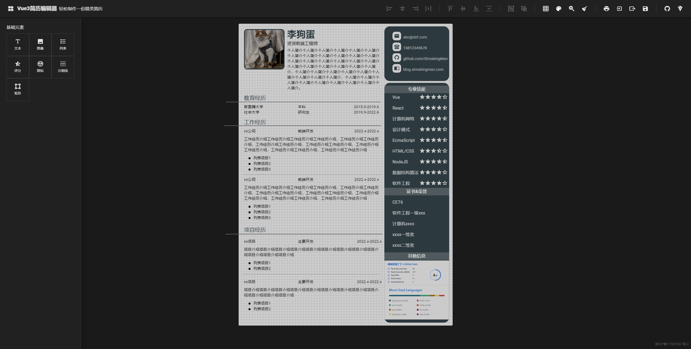

    

 

    
    
    
    
    
    
    
     
    
    
    

# Vue3 Resume Editor

---

vue3+ts 学习项目，web 简历编辑器，轻松制作一份精美简历，[在线地址：https://resume-editor.streakingman.com](https://resume-editor.streakingman.com/)

-   免费
-   灵活，高自由度
-   纯前端应用，不收集隐私数据

## 目录

-   [功能演示](#功能演示)
    -   [基础元素](#基础元素)
    -   [元素缩放控制](#元素缩放控制)
    -   [元素操作栏](#元素操作栏)
    -   [元素配置面板](#元素配置面板)
    -   [对齐&分组](#对齐&分组)
    -   [画布操作](#画布操作)
    -   [画布移动&缩放](#画布移动&缩放)
    -   [使用模板](#使用模板)
    -   [打印/另存 PDF](#打印/另存PDF)
-   [TODO](#TODO)
-   [参与贡献](#参与贡献)

## 功能演示

### 基础元素

### 元素缩放控制

### 元素操作栏

点击元素激活操作栏，包含移动、复制、层级调整、删除、配置面板唤出操作

### 元素配置面板

唤出配置面板，配置元素支持的配置项

### 对齐&分组

按住 shift 点击元素进行多选后，可进行对齐和编组操作

### 画布操作

画布支持辅助网格、背景色、视口缩放控制

### 画布移动&缩放

按住空格可拖拽视口，按住 ctrl 缩放滚轮快捷操作视口缩放

### 使用模板

### 打印/另存 PDF

## TODO

-   [ ] qianduan.pro 评级卡片接入
-   [ ] 历史记录、撤销、重做
-   [ ] 多页模式
-   [ ] 组合套件
-   [ ] 键盘移动
-   [ ] 交互优化

## 参与贡献

-   欢迎提交 issue 和 PR！
-   分享模板也可以通过提交 PR 的方式，导出简历的 json 配置文件，放在`src/components/templates`即可。
